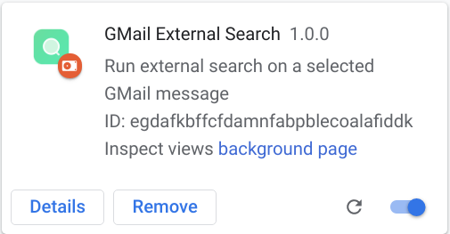
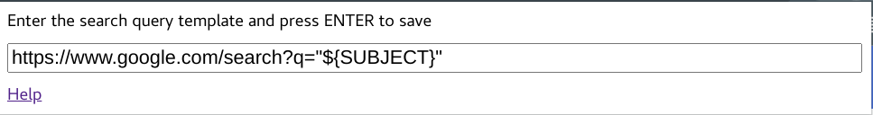

A Chrome extension implementing the following functionality:
1. Running external search queries on the subject of a selected GMail message.
The query results are opened in a new tab.
2. TBD

## Build

Run the following commands to install the dependencies and create an optimized
production build of your extension in the `dist` directory.
```bash
npm install
npm run build
```

> Run `npm start` to start the development server, which watches the project
> contents and automatically rebuilds the extension if any changes are made.

## Installation

This extension is not published in the Chrome Web Store. Follow the instructions
in this section to install an unpacked extension in developer mode.

Open the `chrome://extensions` page in your Google Chrome Browser and make sure
that the `Developer mode` knob is turned on.


Press the `Load unpacked` button and select the `dist` sub-directory of the
`gmail-productivy-tools` project. If the loading is successful, you should see
the extension card appearing in your page.



## Configuration

Press the  button in your browser
and select the `Giga Mail Productivity Tools` extension from the list to open the
extension configuration dialog.


The configuration dialog displays the default search query template, which uses
`google.com` search engine to run the query.



Change the search query according to your needs and press `ENTER` to save the settings.
Specify the `${SUBJECT}` variable in the query where the email subject text should be
substituted.

For instance, the following query runs an email subject search in the Google Groups archives.
```
https://groups.google.com/search/conversations?inOrg=true&q="${SUBJECT}"
```

## Usage

Open an email message in GMail and note the  external
search icon in the toolbox area.
> You may need to press the  menu button to see the full
> list of tools including the external search.

Press the  external search icon to open a new tab with
the query results for the subject of the selected message.

## Appendix A: GMail OAuth 2.0 Credentials

It is necessary to create and configure `GMail OAuth 2.0` credentials to allow
deletion of email threads.

Start by creating a project (e.g. `GMail Productivity Tools`) and select it in the
project drop down menu.

Enable the `Gmail API` service:
* Click on `APIs and services`
* Click on `ENABLE APIS AND SERVICES`
* Search for the `Gmail API` service and enable it for the project

Browse to the `Credentials` menu and click on `CREATE CREDENTIALS` button. Select
`OAuth client ID` in the dropdown list and enter the following data:
* Enter `Chrome extension` as the `Application type`
* Enter arbitrary `Name`
* Enter the `Item ID` matching the extension `ID` presented at `chrome://extensions/`
in `Developer Mode`

Click on `CREATE` button and copy the generated `Client ID` to the `oauth2.client_id`
field of the [manifest.json](./static/manifest.json) file.

Browse to `OAuth consent screen` menu and select `ADD USERS` under `Test users`.
Enter the mail of the user to be allowed to use the project in testing mode.
